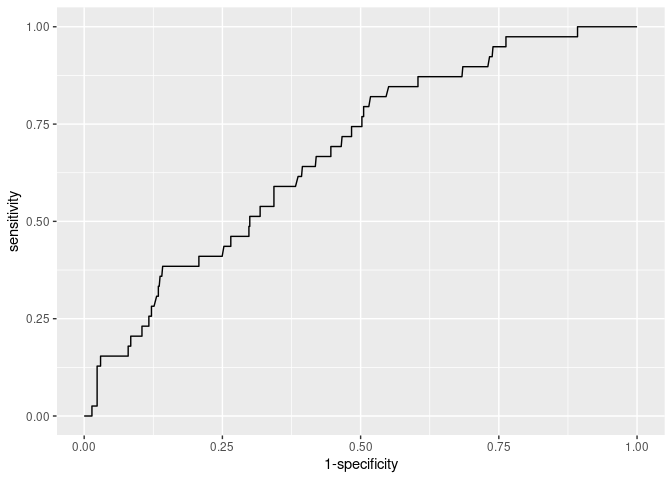
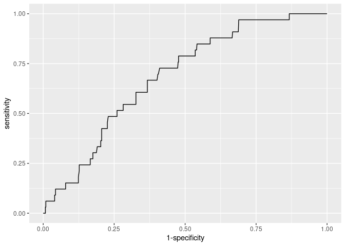
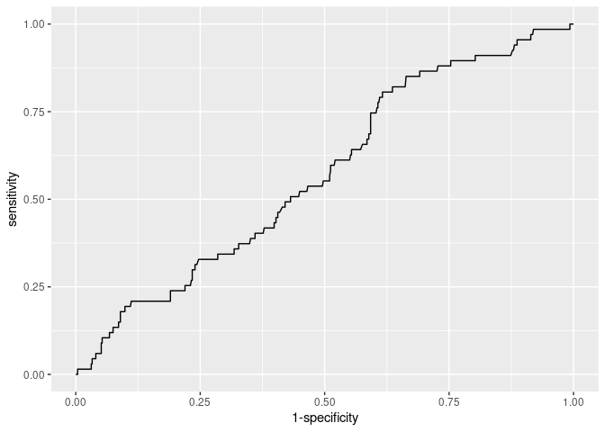
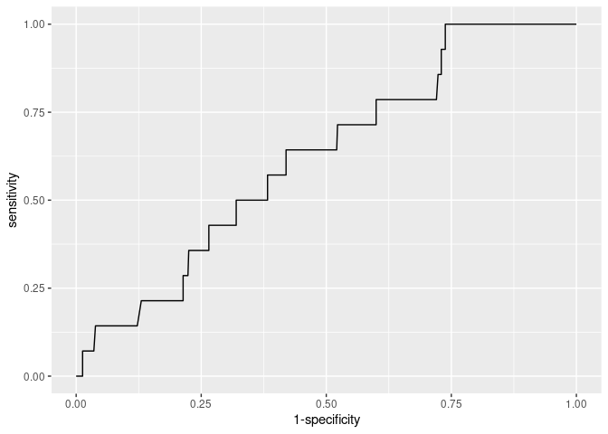
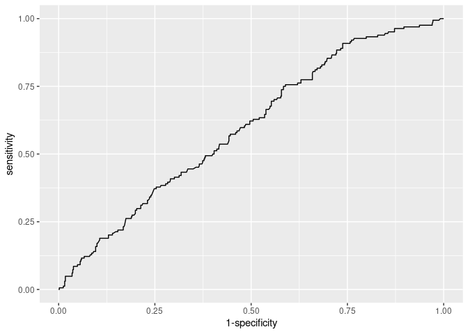
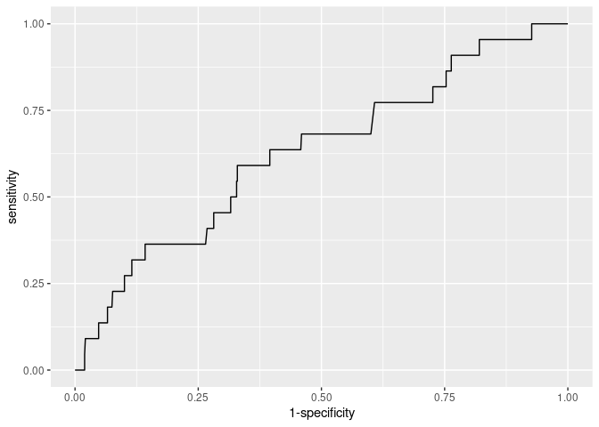
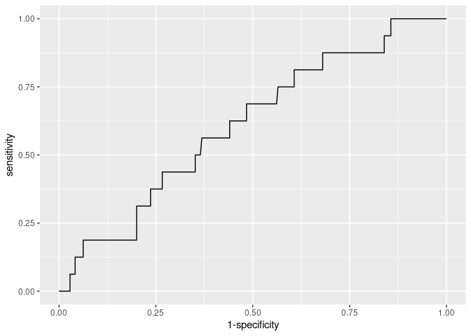
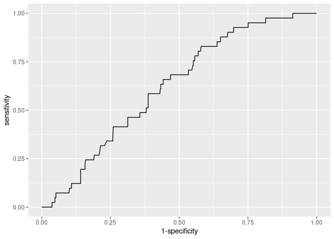
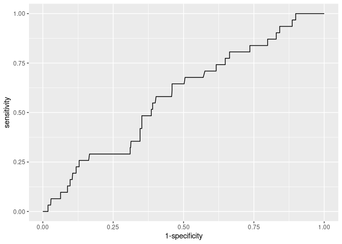

# Load the Data


```r
Masterset <- read.csv("./Cleaned Data_October 2022.csv",
                      header = TRUE, stringsAsFactors = FALSE)
```

## Transforming Variables


```r
Masterset <- mutate(Masterset, Date= as.Date(Date, format= "%d/%m/%Y"))
Masterset$Time <- chron(times = Masterset$Time)
Masterset$Species_Name <- as.factor(Masterset$Species_Name)
Masterset$Site_Type <- as.factor(Masterset$Site_Type)
Masterset$Age <- as.factor(Masterset$Age)

# Simplify the species_name
Masterset$Species_Name <- gsub(".*\\((.*?)\\).*", "\\1", Masterset$Species_Name)
```

# Comparing Years

Here, we test whether there are significant decreases in the number of rescues year-on-year. We also test the changes in proportion of venomous and non-venomous rescues year-on-year.

First, load the Date and Species_Name from the Masterset. Label the rescues as 'venomous' or 'non-venomous'.


```r
month_encounts = data.frame(Masterset$Date, Masterset$Species_Name)
names(month_encounts) <- c('dates', 'species')
# label species type
month_encounts <- mutate(month_encounts, species_type = case_when(
  species == "Bungarus fasciatus" ~ "venomous",
  species == "Bungarus caeruleus" ~ "venomous",
  species == "Naja kaouthia" ~ "venomous",
  species == "Naja naja" ~ "venomous",
  species == "Daboia russelii" ~ "venomous",
  species == " Argyrogena fasciolatus" ~ "non-venomous",
  species == "Indotyphlops braminus" ~ "non-venomous",
  species == "Fowlea piscator" ~ "non-venomous",
  species == "Dendrelaphis tristis" ~ "non-venomous",
  species == "Boiga trigonata" ~ "non-venomous",
  species == "Oligodon arnensis" ~ "non-venomous",
  species == "Ptyas mucosa" ~ "non-venomous",
  species == "Eryx conicus" ~ "non-venomous",
  species == "Ahaetulla nasuta" ~ "non-venomous",
  species == "Lycodon aulicus" ~ "non-venomous",
  species == "Typhlops diardii" ~ "non-venomous",
  species == "Denrelaphis proarchos" ~ "non-venomous",
  species == "Eryx Johnii" ~ "non-venomous",
  species == "Enhydris enhydris" ~ "non-venomous",
  species == "Amphiesma stolatum" ~ "non-venomous",
  species == "Lycodon jara" ~ "non-venomous"))
```

Create a month and year column. 


```r
month_encounts$month =  format(month_encounts$dates, format = "%B")
month_encounts$year = format(month_encounts$dates, format = "%Y")
```

Get the summary of the rescue counts. 


```r
summary_month_encounts <- month_encounts %>% 
  count(species_type, month, year, sort = TRUE)

# There are rows with missing combinations (e.g. non-venomous-- August-- 2022 = n = 0)
summary_month_encounts <- summary_month_encounts %>% 
  add_row(species_type = "non-venomous", month = "August", year = "2022",
          n = 0)
summary_month_encounts <- summary_month_encounts %>% 
  add_row(species_type = "non-venomous", month = "January", year = "2021", 
          n = 0)
summary_month_encounts <- summary_month_encounts %>% 
  add_row(species_type = "non-venomous", month = "July", year = "2022", 
          n = 0)

## Add total number of rescue in each month in each year (venom + non-venom)
summary_month_encounts <- summary_month_encounts %>%
  group_by(month, year) %>%
  summarise(n = sum(n)) %>%
  mutate(species_type = "All Snakes") %>%
  bind_rows(summary_month_encounts) %>%
  arrange(month, year)
```

## Compare 2020 vs 2021 (July to December)


```r
summary_month_encounts %>% 
  group_by(species_type, 
           year = case_when(year == "2020" ~ "2020", year == "2021" ~ "2021"), 
           month = case_when(month == "July" ~ "July", 
                             month == "August" ~ "August", 
                             month == "September" ~ "September", 
                             month == "October" ~ "October", 
                             month == "November" ~ "November",
                             month == "December" ~ "December")) %>%
  summarise(n = sum(n)) %>% na.omit() %>% group_by(species_type, year) %>% 
  summarise(n=sum(n))
```

```
## # A tibble: 6 × 3
## # Groups:   species_type [3]
##   species_type year      n
##   <chr>        <chr> <dbl>
## 1 All Snakes   2020    201
## 2 All Snakes   2021    142
## 3 non-venomous 2020     61
## 4 non-venomous 2021     38
## 5 venomous     2020    140
## 6 venomous     2021    104
```


```r
# Chi-Squared test for venom vs non-venom
chisq.test(matrix(c(61,38,140,104), ncol = 2, byrow = TRUE), correct = F)
```

```
## 
## 	Pearson's Chi-squared test
## 
## data:  matrix(c(61, 38, 140, 104), ncol = 2, byrow = TRUE)
## X-squared = 0.52166, df = 1, p-value = 0.4701
```

```r
# Chi-Squared test for given probabilities for all snakes
obs <- c(201,142)
exp <- c(0.5,0.5)
chisq.test(obs, p=exp)
```

```
## 
## 	Chi-squared test for given probabilities
## 
## data:  obs
## X-squared = 10.149, df = 1, p-value = 0.001444
```

## Compare 2021 vs 2022 (January to October)


```r
summary_month_encounts %>% 
  group_by(species_type, 
           year = case_when(year == "2021" ~ "2021", year == "2022" ~ "2022"), 
           month = case_when(month == "January" ~ "January", 
                             month == "February" ~ "February", 
                             month == "March" ~ "March", 
                             month == "April" ~ "April", 
                             month == "May" ~ "May", 
                             month == "June" ~ "June", 
                             month == "July" ~ "July", 
                             month == "August" ~ "August", 
                             month == "September" ~ "September", 
                             month == "October" ~ "October")) %>%
  summarise(n = sum(n)) %>% na.omit() %>% group_by(species_type, year) %>% 
  summarise(n=sum(n))
```

```
## # A tibble: 6 × 3
## # Groups:   species_type [3]
##   species_type year      n
##   <chr>        <chr> <dbl>
## 1 All Snakes   2021    166
## 2 All Snakes   2022    114
## 3 non-venomous 2021     52
## 4 non-venomous 2022     30
## 5 venomous     2021    114
## 6 venomous     2022     84
```


```r
# Chi-Squared test for venom vs non-venom
chisq.test(matrix(c(52,114,30,84), ncol = 2, byrow = TRUE), correct = F)
```

```
## 
## 	Pearson's Chi-squared test
## 
## data:  matrix(c(52, 114, 30, 84), ncol = 2, byrow = TRUE)
## X-squared = 0.819, df = 1, p-value = 0.3655
```

```r
# Chi-Squared test for given probabilities for all snakes
obs <- c(166,114)
exp <- c(0.5,0.5)
chisq.test(obs, p=exp)
```

```
## 
## 	Chi-squared test for given probabilities
## 
## data:  obs
## X-squared = 9.6571, df = 1, p-value = 0.001886
```

# Site Use Comparison
 
## Individual Sites
We first compare the association between the species type (venomous and non-venomous) and the each of the individual sites. 


```r
VenomvsNonVenom = data.frame(Masterset$Species_Name, Masterset$Site_Type)
#Change column names
names(VenomvsNonVenom) <- c('Species', 'Site')
# Check for rows where there may be blank cells
which(VenomvsNonVenom$Site == "")
```

```
## [1] 133 205 215
```

```r
which(VenomvsNonVenom$Species == "")
```

```
## integer(0)
```

```r
# Remove the rows with blank cells
VenomvsNonVenom <- VenomvsNonVenom[!VenomvsNonVenom$Site=="",]
```

Add column for snake type ( 1 = venomous, 0 = non-venomous)


```r
VenomvsNonVenom <- mutate(VenomvsNonVenom, SnakeType = case_when(
  Species == "Bungarus fasciatus" ~ "1",
  Species == "Bungarus caeruleus" ~ "1",
  Species == "Naja kaouthia" ~ "1",
  Species == "Naja naja" ~ "1",
  Species == "Daboia russelii" ~ "1",
  Species == " Argyrogena fasciolatus" ~ "0",
  Species == "Indotyphlops braminus" ~ "0",
  Species == "Fowlea piscator" ~ "0",
  Species == "Dendrelaphis tristis" ~ "0",
  Species == "Boiga trigonata" ~ "0",
  Species == "Oligodon arnensis" ~ "0",
  Species == "Ptyas mucosa" ~ "0",
  Species == "Eryx conicus" ~ "0",
  Species == "Ahaetulla nasuta" ~ "0",
  Species == "Lycodon aulicus" ~ "0",
  Species == "Typhlops diardii" ~ "0",
  Species == "Denrelaphis proarchos" ~ "0",
  Species == "Eryx Johnii" ~ "0",
  Species == "Enhydris enhydris" ~ "0",
  Species == "Amphiesma stolatum" ~ "0",
  Species == "Lycodon jara" ~ "0"))
```

Check whether there are any sites with low rescue counts


```r
VenomvsNonVenom %>% count(Site, SnakeType, sort = TRUE)
```

```
##                      Site SnakeType   n
## 1  Backyard/ Front Garden         1 133
## 2              Store Room         1  64
## 3  Backyard/ Front Garden         0  41
## 4                 Bedroom         1  36
## 5              Store Room         0  36
## 6                 Kitchen         1  35
## 7                 Bedroom         0  30
## 8                Bathroom         1  21
## 9             Fishing Net         1  13
## 10              Courtyard         1  12
## 11                Kitchen         0  11
## 12                   Shop         1  10
## 13            Fishing Net         0   9
## 14          Fishing Traps         1   9
## 15               Cow Shed         1   8
## 16             Rice Field         1   7
## 17               Bathroom         0   6
## 18                   Shop         0   5
## 19              Courtyard         0   4
## 20              Bird Cage         1   3
## 21                  Canal         1   3
## 22               Cow Shed         0   3
## 23                   Pond         1   3
## 24                   Well         1   3
## 25              Bird Cage         0   2
## 26      Chicken/ Duck Pen         1   2
## 27           Fodder Field         0   2
## 28             Rice Field         0   2
## 29         Bamboo Orchard         1   1
## 30      Chicken/ Duck Pen         0   1
## 31        Groundnut Field         1   1
## 32           Poultry Farm         0   1
```

Combine the following sites which have low counts and are very similar niches: 

-   Well + Pond + Fishing Net + Fishing Traps + Canal = Water Body
-   Rice Field + Groundnut Field + Fodder Field + Bamboo Orchard = Agricultural Field
-   Bird Cage + Chicken/ Duck Pen + Poultry Farm = Bird Enclosure


```r
VenomvsNonVenom <- VenomvsNonVenom %>%
  mutate(Site = case_when(
    Site %in% c('Well', 'Pond', 'Fishing Net', 'Fishing Traps', 'Canal') ~ 'Water Body',
    Site %in% c('Rice Field', 'Groundnut Field', 'Fodder Field', 'Bamboo Orchard') ~ 'Agricultural Field',
    Site %in% c('Bird Cage', 'Chicken/ Duck Pen', 'Poultry Farm') ~ 'Bird Enclosure',
    TRUE ~ Site
  ))
```

Run Chi-Squared Tests at each Site


```r
site_counts <- VenomvsNonVenom %>% count(Site, SnakeType, sort = FALSE)
```


```r
#Agricultural Field: 
obs <- c(4,9)
exp <- c(0.5,0.5)
chisq.test(obs, p=exp)
```

```
## 
## 	Chi-squared test for given probabilities
## 
## data:  obs
## X-squared = 1.9231, df = 1, p-value = 0.1655
```

```r
#Backyard: 
obs <- c(41,133)
exp <- c(0.5,0.5)
chisq.test(obs, p=exp)
```

```
## 
## 	Chi-squared test for given probabilities
## 
## data:  obs
## X-squared = 48.644, df = 1, p-value = 3.07e-12
```

```r
#Bathroom
obs <- c(6,21)
exp <- c(0.5,0.5)
chisq.test(obs, p=exp)
```

```
## 
## 	Chi-squared test for given probabilities
## 
## data:  obs
## X-squared = 8.3333, df = 1, p-value = 0.003892
```

```r
#Bedroom
obs <- c(30,36)
exp <- c(0.5,0.5)
chisq.test(obs, p=exp)
```

```
## 
## 	Chi-squared test for given probabilities
## 
## data:  obs
## X-squared = 0.54545, df = 1, p-value = 0.4602
```

```r
#Bird Enclosure
obs <- c(4,5)
exp <- c(0.5,0.5)
chisq.test(obs, p=exp)
```

```
## 
## 	Chi-squared test for given probabilities
## 
## data:  obs
## X-squared = 0.11111, df = 1, p-value = 0.7389
```

```r
#Courtyard
obs <- c(4,12)
exp <- c(0.5,0.5)
chisq.test(obs, p=exp)
```

```
## 
## 	Chi-squared test for given probabilities
## 
## data:  obs
## X-squared = 4, df = 1, p-value = 0.0455
```

```r
#Cow shed
obs <- c(3,8)
exp <- c(0.5,0.5)
chisq.test(obs, p=exp)
```

```
## 
## 	Chi-squared test for given probabilities
## 
## data:  obs
## X-squared = 2.2727, df = 1, p-value = 0.1317
```

```r
#Kitchen
obs <- c(11,35)
exp <- c(0.5,0.5)
chisq.test(obs, p=exp)
```

```
## 
## 	Chi-squared test for given probabilities
## 
## data:  obs
## X-squared = 12.522, df = 1, p-value = 0.0004022
```

```r
#Shop
obs <- c(5,10)
exp <- c(0.5,0.5)
chisq.test(obs, p=exp)
```

```
## 
## 	Chi-squared test for given probabilities
## 
## data:  obs
## X-squared = 1.6667, df = 1, p-value = 0.1967
```

```r
#Store Room
obs <- c(36,64)
exp <- c(0.5,0.5)
chisq.test(obs, p=exp)
```

```
## 
## 	Chi-squared test for given probabilities
## 
## data:  obs
## X-squared = 7.84, df = 1, p-value = 0.00511
```

```r
#Water Body
obs <- c(9,31)
exp <- c(0.5,0.5)
chisq.test(obs, p=exp)
```

```
## 
## 	Chi-squared test for given probabilities
## 
## data:  obs
## X-squared = 12.1, df = 1, p-value = 0.0005042
```

## Outside vs Inside Sites

Here, we group the sites as outside or inside and then run a chi-squared test. 


```r
OutvsIn = data.frame(Masterset$Species_Name, Masterset$Site_Type)
names(OutvsIn) <- c('Species', 'Site')

# Eliminating Blank Data
OutvsIn <- OutvsIn[!OutvsIn$Site=="",]


# Labeling Venom or Non-Venom
OutvsIn <- mutate(OutvsIn, SnakeType = case_when(
  Species == "Bungarus fasciatus" ~ "1",
  Species == "Bungarus caeruleus" ~ "1",
  Species == "Naja kaouthia" ~ "1",
  Species == "Naja naja" ~ "1",
  Species == "Daboia russelii" ~ "1",
  Species == " Argyrogena fasciolatus" ~ "0",
  Species == "Indotyphlops braminus" ~ "0",
  Species == "Fowlea piscator" ~ "0",
  Species == "Dendrelaphis tristis" ~ "0",
  Species == "Boiga trigonata" ~ "0",
  Species == "Oligodon arnensis" ~ "0",
  Species == "Ptyas mucosa" ~ "0",
  Species == "Eryx conicus" ~ "0",
  Species == "Ahaetulla nasuta" ~ "0",
  Species == "Lycodon aulicus" ~ "0",
  Species == "Typhlops diardii" ~ "0",
  Species == "Denrelaphis proarchos" ~ "0",
  Species == "Eryx Johnii" ~ "0",
  Species == "Enhydris enhydris" ~ "0",
  Species == "Amphiesma stolatum" ~ "0",
  Species == "Lycodon jara" ~ "0"))

# Inside or Outside
OutvsIn <- mutate(OutvsIn, Location = case_when(
  Site == "Backyard/ Front Garden" ~ "Outside",
  Site == "Bamboo Orchard" ~ "Outside",
  Site == "Bathroom" ~ "Inside",
  Site == "Bedroom" ~ "Inside",
  Site == "Bird Cage" ~ "Inside",
  Site == "Canal" ~ "Outside",
  Site == "Chicken/ Duck Pen" ~ "Inside",
  Site == "Courtyard" ~ "Inside",
  Site == "Cow Shed" ~ "Outside",
  Site == "Fishing Net" ~ "Outside",
  Site == "Fishing Traps" ~ "Outside",
  Site == "Fodder Field" ~ "Outside",
  Site == "Groundnut Field" ~ "Outside",
  Site == "Kitchen" ~ "Inside",
  Site == "Pond" ~ "Outside",
  Site == "Poultry Farm" ~ "Inside",
  Site == "Rice Field" ~ "Outside",
  Site == "Shop" ~ "Inside",
  Site == "Store Room" ~ "Inside",
  Site == "Well" ~ "Outside"))
```

Run the Chi-Squared Test


```r
# Create the table on which the chi-squared will be run
table(OutvsIn$SnakeType, OutvsIn$Location)
```

```
##    
##     Inside Outside
##   0     96      57
##   1    183     181
```

```r
# chi squared test
chisq.test(table(OutvsIn$SnakeType, OutvsIn$Location), correct = FALSE)
```

```
## 
## 	Pearson's Chi-squared test
## 
## data:  table(OutvsIn$SnakeType, OutvsIn$Location)
## X-squared = 6.7431, df = 1, p-value = 0.009411
```

# Loading Climate Data

Load the data from the csv file named "IMD_data.csv". 


```r
climate_data <- read.csv("./IMD_data.csv", header = TRUE, 
                         stringsAsFactors = FALSE)
# change the date format in the climate_data
climate_data <- mutate(climate_data, Date = 
                         as.Date(Date, format = "%d/%m/%Y"))
climate_data <- mutate(climate_data, Date = 
                         as.Date(Date, format = "%Y-%m-%d"))
#change the name to match the encounter column name
names(climate_data) <- c('dates', 'max_temp', 'min_temp', 'rain')
#add missing dates 
climate_data <- pad(climate_data)
```

Create single dataframe for each variable. 


```r
# maxtemp
maxtemp = data.frame(climate_data$dates, climate_data$max_temp)
names(maxtemp) <- c('dates', 'maxtemp')
# min temp
mintemp = data.frame(climate_data$dates, climate_data$min_temp)
names(mintemp) <- c('dates', 'mintemp')
# rain
rain = data.frame(climate_data$dates, climate_data$rain)
names(rain) <- c('dates', 'rain')
```

# Effect Of Rain

## Effect on Location and Species Type


```r
rain_sites = data.frame(Masterset$Date, Masterset$Species_Name, Masterset$Site_Type)
names(rain_sites) <- c('dates', 'species', 'site')

rain_sites <- mutate(rain_sites, species_type = case_when(
  species == "Bungarus fasciatus" ~ "venomous",
  species == "Bungarus caeruleus" ~ "venomous",
  species == "Naja kaouthia" ~ "venomous",
  species == "Naja naja" ~ "venomous",
  species == "Daboia russelii" ~ "venomous",
  species == " Argyrogena fasciolatus" ~ "non-venomous",
  species == "Indotyphlops braminus" ~ "non-venomous",
  species == "Fowlea piscator" ~ "non-venomous",
  species == "Dendrelaphis tristis" ~ "non-venomous",
  species == "Boiga trigonata" ~ "non-venomous",
  species == "Oligodon arnensis" ~ "non-venomous",
  species == "Ptyas mucosa" ~ "non-venomous",
  species == "Eryx conicus" ~ "non-venomous",
  species == "Ahaetulla nasuta" ~ "non-venomous",
  species == "Lycodon aulicus" ~ "non-venomous",
  species == "Typhlops diardii" ~ "non-venomous",
  species == "Denrelaphis proarchos" ~ "non-venomous",
  species == "Eryx Johnii" ~ "non-venomous",
  species == "Enhydris enhydris" ~ "non-venomous",
  species == "Amphiesma stolatum" ~ "non-venomous",
  species == "Lycodon jara" ~ "non-venomous"))

rain_sites <- mutate(rain_sites, site_type = case_when(
  site == "Backyard/ Front Garden" ~ "Outside",
  site == "Bamboo Orchard" ~ "Outside",
  site == "Bathroom" ~ "Inside",
  site == "Bedroom" ~ "Inside",
  site == "Bird Cage" ~ "Inside",
  site == "Canal" ~ "Outside",
  site == "Chicken/ Duck Pen" ~ "Inside",
  site == "Courtyard" ~ "Inside",
  site == "Cow Shed" ~ "Outside",
  site == "Fishing Net" ~ "Outside",
  site == "Fishing Traps" ~ "Outside",
  site == "Fodder Field" ~ "Outside",
  site == "Groundnut Field" ~ "Outside",
  site == "Kitchen" ~ "Inside",
  site == "Pond" ~ "Outside",
  site == "Poultry Farm" ~ "Inside",
  site == "Rice Field" ~ "Outside",
  site == "Shop" ~ "Inside",
  site == "Store Room" ~ "Inside",
  site == "Well" ~ "Outside"))
```

Add the rain data. 


```r
rain_sites <- merge(rain_sites, rain, by = "dates")
#remove rows with NA's 
rain_sites <- na.omit(rain_sites)

rain_sites <- rain_sites[, !names(rain_sites) %in% c("species", "site")]

# label dry days and rainy days
rain_sites <- rain_sites %>% mutate(day_type = case_when(rain == 0 ~ "Dry", 
                                             rain > 0 ~ "Rain"))
rain_sites$day_type <- as.factor(rain_sites$day_type)


rain_sites %>% count(species_type, site_type, day_type)
```

```
##   species_type site_type day_type   n
## 1 non-venomous    Inside      Dry  70
## 2 non-venomous    Inside     Rain  19
## 3 non-venomous   Outside      Dry  41
## 4 non-venomous   Outside     Rain  14
## 5     venomous    Inside      Dry 130
## 6     venomous    Inside     Rain  43
## 7     venomous   Outside      Dry 123
## 8     venomous   Outside     Rain  44
```

Run the Chi-Squared Tests. 


```r
# venomous
chisq.test(as.table(rbind(c(130,123), c(43,44))), correct = FALSE)
```

```
## 
## 	Pearson's Chi-squared test
## 
## data:  as.table(rbind(c(130, 123), c(43, 44)))
## X-squared = 0.099319, df = 1, p-value = 0.7526
```

```r
#non-venomous 
chisq.test(as.table(rbind(c(70,41), c(19,14))), correct = FALSE)
```

```
## 
## 	Pearson's Chi-squared test
## 
## data:  as.table(rbind(c(70, 41), c(19, 14)))
## X-squared = 0.32446, df = 1, p-value = 0.5689
```

## Effect of Day Type Combinations


```r
daytype = data.frame(Masterset$Date, Masterset$Species_Name)
names(daytype) <- c('dates' , 'species')
#add dates with no rescues
daytype <- pad(daytype)
# change species to character to allow NA replacement
daytype$species <- as.character(daytype$species)
# change NA to 0 first
daytype <- daytype %>% mutate(species = ifelse(is.na(species), 0, species))
# change back to factor
daytype$species <- as.factor(daytype$species)
#label days with enocunters as "yes or no"
daytype <- mutate(daytype, snake_encounter = ifelse(species == "0", "no", "yes"))
# insert rain and previous rain data to each day
daytype <- merge(daytype, rain, by = "dates")
daytype$rain_prev[2:nrow(daytype)] <- daytype$rain[1:nrow(daytype) - 1]

daytype <- daytype %>% mutate(prevday_type = case_when(rain_prev == 0 ~ "Dry", 
                                                                   rain_prev > 0 ~ "Rain"))
daytype$prevday_type <- as.factor(daytype$prevday_type)

daytype <- daytype %>% mutate(sameday_type = case_when(rain == 0 ~ "Dry", 
                                                                   rain > 0 ~ "Rain"))
daytype$sameday_type <- as.factor(daytype$sameday_type)

#create prev:same day column 
daytype$day_diff = daytype$prevday_type:daytype$sameday_type
daytype$day_diff <- as.factor(daytype$day_diff)
# remove multiple day rows
daytype <- daytype[!duplicated(daytype[c('dates')]),]
```


```r
table( daytype$day_diff, daytype$snake_encounter)
```

```
##            
##              no yes
##   Dry:Dry   293 183
##   Dry:Rain   56  23
##   Rain:Dry   44  36
##   Rain:Rain  57  48
```

Run the chi-squared tests for each of combination of day_diff. 


```r
# Dry:Dry vs Dry:Rain
prev_day_compare <- matrix(c(293,183,56,23), ncol=2, byrow = TRUE)
chisq.test(prev_day_compare, correct = F)
```

```
## 
## 	Pearson's Chi-squared test
## 
## data:  prev_day_compare
## X-squared = 2.5277, df = 1, p-value = 0.1119
```

```r
# Dry:Dry vs Rain:Dry
prev_day_compare <- matrix(c(293,183,44,36), ncol=2, byrow = TRUE)
chisq.test(prev_day_compare, correct = F)
```

```
## 
## 	Pearson's Chi-squared test
## 
## data:  prev_day_compare
## X-squared = 1.2325, df = 1, p-value = 0.2669
```

```r
# Dry:Dry vs Rain:Rain
prev_day_compare <- matrix(c(293, 183,57,48), ncol=2, byrow = TRUE)
chisq.test(prev_day_compare, correct = F)
```

```
## 
## 	Pearson's Chi-squared test
## 
## data:  prev_day_compare
## X-squared = 1.8977, df = 1, p-value = 0.1683
```

```r
# Dry:Rain vs Rain:Dry
prev_day_compare <- matrix(c(56,23,44,36), ncol=2, byrow = TRUE)
chisq.test(prev_day_compare, correct = F)
```

```
## 
## 	Pearson's Chi-squared test
## 
## data:  prev_day_compare
## X-squared = 4.2983, df = 1, p-value = 0.03815
```

```r
# Dry:Rain vs Rain:Rain
prev_day_compare <- matrix(c(56,23,57,48), ncol=2, byrow = TRUE)
chisq.test(prev_day_compare, correct = F)
```

```
## 
## 	Pearson's Chi-squared test
## 
## data:  prev_day_compare
## X-squared = 5.2424, df = 1, p-value = 0.02204
```

```r
#Rain:Dry vs Rain:Rain
prev_day_compare <- matrix(c(44,36,57,48), ncol=2, byrow = TRUE)
chisq.test(prev_day_compare, correct = F)
```

```
## 
## 	Pearson's Chi-squared test
## 
## data:  prev_day_compare
## X-squared = 0.0093453, df = 1, p-value = 0.923
```

We will also test to see whether there is an association between the daytype combination and the locations of the rescue.


```r
daytype_location = data.frame(Masterset$Date, Masterset$Site_Type)
names(daytype_location) <- c('dates', 'site')
daytype_location <- mutate(daytype_location, site_type = case_when(
  site == "Backyard/ Front Garden" ~ "Outside",
  site == "Bamboo Orchard" ~ "Outside",
  site == "Bathroom" ~ "Inside",
  site == "Bedroom" ~ "Inside",
  site == "Bird Cage" ~ "Inside",
  site == "Canal" ~ "Outside",
  site == "Chicken/ Duck Pen" ~ "Inside",
  site == "Courtyard" ~ "Inside",
  site == "Cow Shed" ~ "Outside",
  site == "Fishing Net" ~ "Outside",
  site == "Fishing Traps" ~ "Outside",
  site == "Fodder Field" ~ "Outside",
  site == "Groundnut Field" ~ "Outside",
  site == "Kitchen" ~ "Inside",
  site == "Pond" ~ "Outside",
  site == "Poultry Farm" ~ "Inside",
  site == "Rice Field" ~ "Outside",
  site == "Shop" ~ "Inside",
  site == "Store Room" ~ "Inside",
  site == "Well" ~ "Outside"))
daytype_location <- pad(daytype_location)

daytype_location <- merge(daytype_location, rain, by = "dates")
daytype_location$rain_prev[2:nrow(daytype_location)] <- daytype_location$rain[1:nrow(daytype_location) - 1]

daytype_location <- daytype_location %>% mutate(prevday_type = case_when(rain_prev == 0 ~ "Dry", 
                                                                   rain_prev > 0 ~ "Rain"))
daytype_location$prevday_type <- as.factor(daytype_location$prevday_type)

daytype_location <- daytype_location %>% mutate(sameday_type = case_when(rain == 0 ~ "Dry", 
                                                                   rain > 0 ~ "Rain"))
daytype_location$sameday_type <- as.factor(daytype_location$sameday_type)

#create prev:same day column 
daytype_location$day_diff = daytype_location$prevday_type:daytype_location$sameday_type
daytype_location$day_diff <- as.factor(daytype_location$day_diff)

daytype_location <- na.omit(daytype_location)
```


```r
table(daytype_location$site_type, daytype_location$day_diff)
```

```
##          
##           Dry:Dry Dry:Rain Rain:Dry Rain:Rain
##   Inside      180       15       18        46
##   Outside     145        7       18        50
```

```r
# Running the chi-squared test
chisq.test(table(daytype_location$site_type, daytype_location$day_diff))
```

```
## 
## 	Pearson's Chi-squared test
## 
## data:  table(daytype_location$site_type, daytype_location$day_diff)
## X-squared = 3.6941, df = 3, p-value = 0.2964
```

# Most Rescued Species

## Comparing Climate Effects

### Rain


```r
rain_select= data.frame(Masterset$Date, Masterset$Species_Name)
names(rain_select) <-  c('dates', 'species')
rain_select <- rain_select[rain_select$species %in% c( "Fowlea piscator" , "Dendrelaphis tristis" ,
                                                             "Ptyas mucosa", "Lycodon aulicus", 
                                                             "Bungarus fasciatus", "Bungarus caeruleus",
                                                             "Naja kaouthia", "Naja naja","Daboia russelii" ), ]
rain_select <- merge(rain_select, rain, by = "dates")
#remove rows with NA's 
rain_select <- na.omit(rain_select)
#remove the date column
rain_select <- rain_select[, !names(rain_select) %in% c("dates")]
```

Check the assumptions for a one-way ANOVA.


```r
### create the model
model_rain <- aov(rain~species, data = rain_select)
### normality
shapiro.test(residuals(model_rain))
```

```
## 
## 	Shapiro-Wilk normality test
## 
## data:  residuals(model_rain)
## W = 0.57637, p-value < 2.2e-16
```

```r
### homogeneity of variance
leveneTest(model_rain)
```

```
## Levene's Test for Homogeneity of Variance (center = median)
##        Df F value Pr(>F)
## group   8  0.6748 0.7139
##       455
```

```r
### independence
durbinWatsonTest(model_rain)
```

```
##  lag Autocorrelation D-W Statistic p-value
##    1       0.5130554     0.9731223       0
##  Alternative hypothesis: rho != 0
```
Assumptions have been violated. 

```r
# Run a Kruskal Wallis Test
kruskal_test(rain~species, data = rain_select)
```

```
## # A tibble: 1 × 6
##   .y.       n statistic    df     p method        
## * <chr> <int>     <dbl> <int> <dbl> <chr>         
## 1 rain    464      8.68     8  0.37 Kruskal-Wallis
```

### Minimum Temperature


```r
mintemp_select= data.frame(Masterset$Date, Masterset$Species_Name)
names(mintemp_select) <-  c('dates', 'species')
mintemp_select <- mintemp_select[mintemp_select$species %in% c( "Fowlea piscator" , "Dendrelaphis tristis" ,
                                                             "Ptyas mucosa", "Lycodon aulicus", 
                                                             "Bungarus fasciatus", "Bungarus caeruleus",
                                                             "Naja kaouthia", "Naja naja","Daboia russelii" ), ]
mintemp_select <- merge(mintemp_select, mintemp, by = "dates")
#remove rows with NA's 
mintemp_select <- na.omit(mintemp_select)
#remove the date column
mintemp_select <- mintemp_select[, !names(mintemp_select) %in% c("dates")]
```

Check the assumptions for a one-way ANOVA.


```r
### create the model
model_mintemp <- aov(mintemp~species, data = mintemp_select)
### normality
shapiro.test(residuals(model_mintemp))
```

```
## 
## 	Shapiro-Wilk normality test
## 
## data:  residuals(model_mintemp)
## W = 0.8835, p-value < 2.2e-16
```

```r
### homogeneity of variance
leveneTest(model_mintemp)
```

```
## Levene's Test for Homogeneity of Variance (center = median)
##        Df F value   Pr(>F)   
## group   8  3.1266 0.001883 **
##       454                    
## ---
## Signif. codes:  0 '***' 0.001 '**' 0.01 '*' 0.05 '.' 0.1 ' ' 1
```

```r
### independence
durbinWatsonTest(model_mintemp)
```

```
##  lag Autocorrelation D-W Statistic p-value
##    1       0.8611095     0.2774887       0
##  Alternative hypothesis: rho != 0
```

Assumptions have been violated. 


```r
# Run a Kruskal Wallis Test
kruskal_test(mintemp~species, data = mintemp_select)
```

```
## # A tibble: 1 × 6
##   .y.         n statistic    df        p method        
## * <chr>   <int>     <dbl> <int>    <dbl> <chr>         
## 1 mintemp   463      27.8     8 0.000507 Kruskal-Wallis
```

```r
# post-hoc test
pwc_mintemp <- dunn_test(mintemp~species, data = mintemp_select)
print(pwc_mintemp, n=36)
```

```
## # A tibble: 36 × 9
##    .y.     group1      group2    n1    n2 statistic       p   p.adj p.adj.signif
##  * <chr>   <chr>       <chr>  <int> <int>     <dbl>   <dbl>   <dbl> <chr>       
##  1 mintemp Bungarus c… Bunga…    34    41  -0.678   4.98e-1 1       ns          
##  2 mintemp Bungarus c… Daboi…    34    72  -4.03    5.68e-5 0.00204 **          
##  3 mintemp Bungarus c… Dendr…    34    17  -2.81    4.93e-3 0.163   ns          
##  4 mintemp Bungarus c… Fowle…    34    26  -2.48    1.31e-2 0.407   ns          
##  5 mintemp Bungarus c… Lycod…    34    33  -1.79    7.29e-2 1       ns          
##  6 mintemp Bungarus c… Naja …    34    15  -0.731   4.65e-1 1       ns          
##  7 mintemp Bungarus c… Naja …    34   178  -1.75    7.98e-2 1       ns          
##  8 mintemp Bungarus c… Ptyas…    34    47  -1.64    1.02e-1 1       ns          
##  9 mintemp Bungarus f… Daboi…    41    72  -3.48    5.06e-4 0.0172  *           
## 10 mintemp Bungarus f… Dendr…    41    17  -2.35    1.88e-2 0.564   ns          
## 11 mintemp Bungarus f… Fowle…    41    26  -1.95    5.12e-2 1       ns          
## 12 mintemp Bungarus f… Lycod…    41    33  -1.20    2.30e-1 1       ns          
## 13 mintemp Bungarus f… Naja …    41    15  -0.230   8.18e-1 1       ns          
## 14 mintemp Bungarus f… Naja …    41   178  -0.985   3.25e-1 1       ns          
## 15 mintemp Bungarus f… Ptyas…    41    47  -0.989   3.23e-1 1       ns          
## 16 mintemp Daboia rus… Dendr…    72    17   0.00953 9.92e-1 1       ns          
## 17 mintemp Daboia rus… Fowle…    72    26   0.837   4.02e-1 1       ns          
## 18 mintemp Daboia rus… Lycod…    72    33   1.90    5.74e-2 1       ns          
## 19 mintemp Daboia rus… Naja …    72    15   2.15    3.13e-2 0.909   ns          
## 20 mintemp Daboia rus… Naja …    72   178   3.65    2.62e-4 0.00917 **          
## 21 mintemp Daboia rus… Ptyas…    72    47   2.50    1.24e-2 0.396   ns          
## 22 mintemp Dendrelaph… Fowle…    17    26   0.606   5.45e-1 1       ns          
## 23 mintemp Dendrelaph… Lycod…    17    33   1.33    1.84e-1 1       ns          
## 24 mintemp Dendrelaph… Naja …    17    15   1.72    8.59e-2 1       ns          
## 25 mintemp Dendrelaph… Naja …    17   178   2.00    4.57e-2 1       ns          
## 26 mintemp Dendrelaph… Ptyas…    17    47   1.65    9.93e-2 1       ns          
## 27 mintemp Fowlea pis… Lycod…    26    33   0.793   4.28e-1 1       ns          
## 28 mintemp Fowlea pis… Naja …    26    15   1.29    1.96e-1 1       ns          
## 29 mintemp Fowlea pis… Naja …    26   178   1.52    1.30e-1 1       ns          
## 30 mintemp Fowlea pis… Ptyas…    26    47   1.14    2.56e-1 1       ns          
## 31 mintemp Lycodon au… Naja …    33    15   0.680   4.97e-1 1       ns          
## 32 mintemp Lycodon au… Naja …    33   178   0.583   5.60e-1 1       ns          
## 33 mintemp Lycodon au… Ptyas…    33    47   0.307   7.59e-1 1       ns          
## 34 mintemp Naja kaout… Naja …    15   178  -0.376   7.07e-1 1       ns          
## 35 mintemp Naja kaout… Ptyas…    15    47  -0.479   6.32e-1 1       ns          
## 36 mintemp Naja naja   Ptyas…   178    47  -0.249   8.04e-1 1       ns
```

### Maximum Temperature


```r
maxtemp_select= data.frame(Masterset$Date, Masterset$Species_Name)
names(maxtemp_select) <-  c('dates', 'species')
maxtemp_select <- maxtemp_select[maxtemp_select$species %in% c( "Fowlea piscator" , "Dendrelaphis tristis" ,
                                                             "Ptyas mucosa", "Lycodon aulicus", 
                                                             "Bungarus fasciatus", "Bungarus caeruleus",
                                                             "Naja kaouthia", "Naja naja","Daboia russelii" ), ]
maxtemp_select <- merge(maxtemp_select, maxtemp, by = "dates")
#remove rows with NA's 
maxtemp_select <- na.omit(maxtemp_select)
#remove the date column
maxtemp_select <- maxtemp_select[, !names(maxtemp_select) %in% c("dates")]
```

Check the assumptions for a one-way ANOVA.


```r
### create the model
model_maxtemp <- aov(maxtemp~species, data = maxtemp_select)
### normality
shapiro.test(residuals(model_maxtemp))
```

```
## 
## 	Shapiro-Wilk normality test
## 
## data:  residuals(model_maxtemp)
## W = 0.9552, p-value = 3.554e-10
```

```r
### homogeneity of variance
leveneTest(model_maxtemp)
```

```
## Levene's Test for Homogeneity of Variance (center = median)
##        Df F value Pr(>F)
## group   8  1.5928 0.1248
##       423
```

```r
### independence
durbinWatsonTest(model_maxtemp)
```

```
##  lag Autocorrelation D-W Statistic p-value
##    1       0.7916678     0.4160015       0
##  Alternative hypothesis: rho != 0
```

Assumptions have been violated. 


```r
# Run a Kruskal Wallis Test
kruskal_test(maxtemp~species, data = maxtemp_select)
```

```
## # A tibble: 1 × 6
##   .y.         n statistic    df      p method        
## * <chr>   <int>     <dbl> <int>  <dbl> <chr>         
## 1 maxtemp   432      13.5     8 0.0949 Kruskal-Wallis
```

### Temperature Range


```r
temprange_select= data.frame(Masterset$Date, Masterset$Species_Name)
names(temprange_select) <-  c('dates', 'species')
temprange_select <- temprange_select[temprange_select$species %in% c( "Fowlea piscator" , "Dendrelaphis tristis" ,
                                                             "Ptyas mucosa", "Lycodon aulicus", 
                                                             "Bungarus fasciatus", "Bungarus caeruleus",
                                                             "Naja kaouthia", "Naja naja","Daboia russelii" ), ]
```

First, create the temperature range dataframe. 


```r
# Creating temprange
temprange <- merge(mintemp, maxtemp, by = "dates")
temprange$temprange <- temprange$maxtemp - temprange$mintemp
temprange <- temprange[, !names(temprange) %in% c("mintemp", "maxtemp")]
temprange_select <- merge(temprange_select, temprange, by = "dates")
#remove rows with NA's 
temprange_select <- na.omit(temprange_select)
#remove the date column
temprange_select <- temprange_select[, !names(temprange_select) %in% c("dates")]
```

Check the assumptions for a one-way ANOVA.


```r
### create the model
model_temprange <- aov(temprange~species, data = temprange_select)
### normality
shapiro.test(residuals(model_temprange))
```

```
## 
## 	Shapiro-Wilk normality test
## 
## data:  residuals(model_temprange)
## W = 0.99406, p-value = 0.091
```

```r
### homogeneity of variance
leveneTest(model_temprange)
```

```
## Levene's Test for Homogeneity of Variance (center = median)
##        Df F value Pr(>F)
## group   8  0.8588 0.5514
##       422
```

```r
### independence
durbinWatsonTest(model_temprange)
```

```
##  lag Autocorrelation D-W Statistic p-value
##    1        0.656815     0.6827829       0
##  Alternative hypothesis: rho != 0
```

Assumptions have not been violated. 


```r
# Run a Kruskal Wallis Test
anova_test(temprange~species, data = temprange_select)
```

```
## ANOVA Table (type II tests)
## 
##    Effect DFn DFd     F     p p<.05   ges
## 1 species   8 422 2.702 0.007     * 0.049
```

```r
pwc_temprange <- temprange_select %>% tukey_hsd(temprange ~ species)
print(pwc_temprange, n=36, width = Inf)
```

```
## # A tibble: 36 × 9
##    term    group1               group2               null.value estimate
##  * <chr>   <chr>                <chr>                     <dbl>    <dbl>
##  1 species Bungarus caeruleus   Bungarus fasciatus            0  0.422  
##  2 species Bungarus caeruleus   Daboia russelii               0  2.14   
##  3 species Bungarus caeruleus   Dendrelaphis tristis          0  2.14   
##  4 species Bungarus caeruleus   Fowlea piscator               0  2.33   
##  5 species Bungarus caeruleus   Lycodon aulicus               0  2.13   
##  6 species Bungarus caeruleus   Naja kaouthia                 0  1.25   
##  7 species Bungarus caeruleus   Naja naja                     0  1.01   
##  8 species Bungarus caeruleus   Ptyas mucosa                  0  1.70   
##  9 species Bungarus fasciatus   Daboia russelii               0  1.72   
## 10 species Bungarus fasciatus   Dendrelaphis tristis          0  1.71   
## 11 species Bungarus fasciatus   Fowlea piscator               0  1.90   
## 12 species Bungarus fasciatus   Lycodon aulicus               0  1.71   
## 13 species Bungarus fasciatus   Naja kaouthia                 0  0.825  
## 14 species Bungarus fasciatus   Naja naja                     0  0.587  
## 15 species Bungarus fasciatus   Ptyas mucosa                  0  1.28   
## 16 species Daboia russelii      Dendrelaphis tristis          0 -0.00441
## 17 species Daboia russelii      Fowlea piscator               0  0.184  
## 18 species Daboia russelii      Lycodon aulicus               0 -0.00754
## 19 species Daboia russelii      Naja kaouthia                 0 -0.894  
## 20 species Daboia russelii      Naja naja                     0 -1.13   
## 21 species Daboia russelii      Ptyas mucosa                  0 -0.444  
## 22 species Dendrelaphis tristis Fowlea piscator               0  0.189  
## 23 species Dendrelaphis tristis Lycodon aulicus               0 -0.00313
## 24 species Dendrelaphis tristis Naja kaouthia                 0 -0.889  
## 25 species Dendrelaphis tristis Naja naja                     0 -1.13   
## 26 species Dendrelaphis tristis Ptyas mucosa                  0 -0.439  
## 27 species Fowlea piscator      Lycodon aulicus               0 -0.192  
## 28 species Fowlea piscator      Naja kaouthia                 0 -1.08   
## 29 species Fowlea piscator      Naja naja                     0 -1.32   
## 30 species Fowlea piscator      Ptyas mucosa                  0 -0.628  
## 31 species Lycodon aulicus      Naja kaouthia                 0 -0.886  
## 32 species Lycodon aulicus      Naja naja                     0 -1.12   
## 33 species Lycodon aulicus      Ptyas mucosa                  0 -0.436  
## 34 species Naja kaouthia        Naja naja                     0 -0.239  
## 35 species Naja kaouthia        Ptyas mucosa                  0  0.450  
## 36 species Naja naja            Ptyas mucosa                  0  0.689  
##    conf.low conf.high  p.adj p.adj.signif
##  *    <dbl>     <dbl>  <dbl> <chr>       
##  1  -1.88       2.73  1      ns          
##  2   0.0751     4.21  0.0356 *           
##  3  -0.830      5.10  0.378  ns          
##  4  -0.355      5.01  0.149  ns          
##  5  -0.283      4.55  0.133  ns          
##  6  -1.86       4.35  0.944  ns          
##  7  -0.848      2.87  0.75   ns          
##  8  -0.568      3.96  0.323  ns          
##  9  -0.237      3.68  0.137  ns          
## 10  -1.18       4.61  0.649  ns          
## 11  -0.694      4.50  0.354  ns          
## 12  -0.612      4.03  0.346  ns          
## 13  -2.21       3.86  0.995  ns          
## 14  -1.15       2.32  0.98   ns          
## 15  -0.891      3.44  0.658  ns          
## 16  -2.71       2.70  1      ns          
## 17  -2.20       2.57  1      ns          
## 18  -2.10       2.08  1      ns          
## 19  -3.75       1.96  0.988  ns          
## 20  -2.54       0.271 0.227  ns          
## 21  -2.36       1.47  0.998  ns          
## 22  -3.01       3.39  1      ns          
## 23  -2.99       2.98  1      ns          
## 24  -4.45       2.68  0.997  ns          
## 25  -3.68       1.42  0.905  ns          
## 26  -3.30       2.42  1      ns          
## 27  -2.89       2.51  1      ns          
## 28  -4.41       2.25  0.985  ns          
## 29  -3.53       0.894 0.644  ns          
## 30  -3.19       1.94  0.998  ns          
## 31  -4.01       2.24  0.994  ns          
## 32  -3.01       0.757 0.639  ns          
## 33  -2.72       1.85  1      ns          
## 34  -2.95       2.47  1      ns          
## 35  -2.56       3.46  1      ns          
## 36  -0.995      2.37  0.938  ns
```

## Binary Logistic Regression Models


```r
# make climate data
climate_data <- rain
climate_data$rain_prev <- c(NA, climate_data$rain[-nrow(climate_data)])  
climate_data <- merge(climate_data, mintemp, by = "dates")
climate_data <- merge(climate_data, maxtemp, by = "dates")
climate_data <- pad(climate_data)
```

Test whether the climate variables are collinear. 


```r
# Correlation Matrix
climate_correlation <- climate_data[, c("rain", "rain_prev", 
                                        "mintemp", "maxtemp")]

climate_correlation <- na.omit(climate_correlation)
vif(climate_correlation)
```

```
##   Variables      VIF
## 1      rain 1.128907
## 2 rain_prev 1.181178
## 3   mintemp 3.117688
## 4   maxtemp 2.959750
```

All the VIF scores are less than 5. 

We will now run models on each of the species.


```r
climate_species <- data.frame(Masterset$Date, Masterset$Species_Name)
names(climate_species) <- c('dates', 'species')
```


```r
# for Bungarus fasciatus
climate_fasciatus <- subset(climate_species, species %in% c("Bungarus fasciatus"))
climate_fasciatus <- pad(climate_fasciatus)
climate_fasciatus$presence <- ifelse(is.na(climate_fasciatus$species), 0, 
                                     ifelse(climate_fasciatus$species == "Bungarus fasciatus", 1, 0))
climate_fasciatus <- subset(climate_fasciatus, select = -species)

climate_fasciatus <- merge(climate_fasciatus, climate_data, by = "dates")
climate_fasciatus <- subset(climate_fasciatus, select = -dates )
climate_fasciatus <- na.omit(climate_fasciatus)
# making the model
model_fasciatus <- glm(presence ~ rain + rain_prev + maxtemp + mintemp, 
                       data = climate_fasciatus, family = binomial(link = "logit"))
summary(model_fasciatus)
```

```
## 
## Call:
## glm(formula = presence ~ rain + rain_prev + maxtemp + mintemp, 
##     family = binomial(link = "logit"), data = climate_fasciatus)
## 
## Coefficients:
##              Estimate Std. Error z value Pr(>|z|)   
## (Intercept) -5.487846   1.815368  -3.023   0.0025 **
## rain        -0.002439   0.013725  -0.178   0.8590   
## rain_prev    0.018177   0.009267   1.961   0.0498 * 
## maxtemp     -0.016984   0.074096  -0.229   0.8187   
## mintemp      0.130568   0.063978   2.041   0.0413 * 
## ---
## Signif. codes:  0 '***' 0.001 '**' 0.01 '*' 0.05 '.' 0.1 ' ' 1
## 
## (Dispersion parameter for binomial family taken to be 1)
## 
##     Null deviance: 298.68  on 679  degrees of freedom
## Residual deviance: 284.06  on 675  degrees of freedom
## AIC: 294.06
## 
## Number of Fisher Scoring iterations: 6
```

```r
res_fasciatus <- roc(presence ~ fitted(model_fasciatus), 
                     data = climate_fasciatus)
res_fasciatus$auc
```

```
## Area under the curve: 0.6772
```

```r
ggroc(res_fasciatus, legacy.axes = TRUE)
```

<!-- -->

```r
# for Bungarus caeruleus
climate_caeruleus <- subset(climate_species, species %in% c("Bungarus caeruleus"))
climate_caeruleus <- pad(climate_caeruleus)
climate_caeruleus$presence <- ifelse(is.na(climate_caeruleus$species), 0, 
                                     ifelse(climate_caeruleus$species == "Bungarus caeruleus", 1, 0))
climate_caeruleus <- subset(climate_caeruleus, select = -species)

climate_caeruleus <- merge(climate_caeruleus, climate_data, by = "dates")
climate_caeruleus <- subset(climate_caeruleus, select = -dates )
climate_caeruleus <- na.omit(climate_caeruleus)
# making the model
model_caeruleus <- glm(presence ~ rain + rain_prev + maxtemp + mintemp, 
                       data = climate_caeruleus, family = binomial(link = "logit"))
summary(model_caeruleus)
```

```
## 
## Call:
## glm(formula = presence ~ rain + rain_prev + maxtemp + mintemp, 
##     family = binomial(link = "logit"), data = climate_caeruleus)
## 
## Coefficients:
##              Estimate Std. Error z value Pr(>|z|)   
## (Intercept) -4.878492   1.990713  -2.451  0.01426 * 
## rain         0.006316   0.011623   0.543  0.58682   
## rain_prev    0.004843   0.011544   0.420  0.67484   
## maxtemp     -0.097348   0.080885  -1.204  0.22877   
## mintemp      0.208084   0.072325   2.877  0.00401 **
## ---
## Signif. codes:  0 '***' 0.001 '**' 0.01 '*' 0.05 '.' 0.1 ' ' 1
## 
## (Dispersion parameter for binomial family taken to be 1)
## 
##     Null deviance: 263.96  on 678  degrees of freedom
## Residual deviance: 249.39  on 674  degrees of freedom
## AIC: 259.39
## 
## Number of Fisher Scoring iterations: 6
```

```r
res_caeruleus <- roc(presence ~ fitted(model_caeruleus), 
                     data = climate_caeruleus)
res_caeruleus$auc
```

```
## Area under the curve: 0.6843
```

```r
ggroc(res_caeruleus, legacy.axes = TRUE)
```

<!-- -->

```r
# for Daboia russelii
climate_russelii <- subset(climate_species, species %in% c("Daboia russelii"))
climate_russelii <- pad(climate_russelii)
climate_russelii$presence <- ifelse(is.na(climate_russelii$species), 0, 
                                    ifelse(climate_russelii$species == "Daboia russelii", 1, 0))
climate_russelii <- subset(climate_russelii, select = -species)

climate_russelii <- merge(climate_russelii, climate_data, by = "dates")
climate_russelii <- subset(climate_russelii, select = -dates )
climate_russelii <- na.omit(climate_russelii)
# making the model
model_russelii <- glm(presence ~ rain + rain_prev + maxtemp + mintemp, 
                      data = climate_russelii, family = binomial(link = "logit"))
summary(model_russelii)
```

```
## 
## Call:
## glm(formula = presence ~ rain + rain_prev + maxtemp + mintemp, 
##     family = binomial(link = "logit"), data = climate_russelii)
## 
## Coefficients:
##              Estimate Std. Error z value Pr(>|z|)  
## (Intercept) -2.597946   1.087569  -2.389   0.0169 *
## rain         0.009837   0.011077   0.888   0.3745  
## rain_prev    0.012091   0.011060   1.093   0.2743  
## maxtemp      0.046903   0.053989   0.869   0.3850  
## mintemp     -0.049719   0.045757  -1.087   0.2772  
## ---
## Signif. codes:  0 '***' 0.001 '**' 0.01 '*' 0.05 '.' 0.1 ' ' 1
## 
## (Dispersion parameter for binomial family taken to be 1)
## 
##     Null deviance: 423.26  on 613  degrees of freedom
## Residual deviance: 420.37  on 609  degrees of freedom
## AIC: 430.37
## 
## Number of Fisher Scoring iterations: 4
```

```r
res_russelii <- roc(presence ~ fitted(model_russelii), 
                    data = climate_russelii)
res_russelii$auc
```

```
## Area under the curve: 0.572
```

```r
ggroc(res_russelii, legacy.axes = TRUE)
```

<!-- -->

```r
# for Naja kaouthia
climate_kaouthia <- subset(climate_species, species %in% c("Naja kaouthia"))
climate_kaouthia <- pad(climate_kaouthia)
climate_kaouthia$presence <- ifelse(is.na(climate_kaouthia$species), 0, 
                                    ifelse(climate_kaouthia$species == "Naja kaouthia", 1, 0))
climate_kaouthia <- subset(climate_kaouthia, select = -species)

climate_kaouthia <- merge(climate_kaouthia, climate_data, by = "dates")
climate_kaouthia <- subset(climate_kaouthia, select = -dates )
climate_kaouthia <- na.omit(climate_kaouthia)
# making the model
model_kaouthia <- glm(presence ~ rain + rain_prev + maxtemp + mintemp, 
                      data = climate_kaouthia, family = binomial(link = "logit"))
summary(model_kaouthia)
```

```
## 
## Call:
## glm(formula = presence ~ rain + rain_prev + maxtemp + mintemp, 
##     family = binomial(link = "logit"), data = climate_kaouthia)
## 
## Coefficients:
##             Estimate Std. Error z value Pr(>|z|)  
## (Intercept) -4.16606    2.41034  -1.728   0.0839 .
## rain        -0.01728    0.04255  -0.406   0.6846  
## rain_prev   -0.05321    0.05831  -0.913   0.3615  
## maxtemp     -0.06457    0.11467  -0.563   0.5734  
## mintemp      0.11495    0.09631   1.194   0.2327  
## ---
## Signif. codes:  0 '***' 0.001 '**' 0.01 '*' 0.05 '.' 0.1 ' ' 1
## 
## (Dispersion parameter for binomial family taken to be 1)
## 
##     Null deviance: 134.54  on 635  degrees of freedom
## Residual deviance: 131.37  on 631  degrees of freedom
## AIC: 141.37
## 
## Number of Fisher Scoring iterations: 8
```

```r
res_kaouthia <- roc(presence ~ fitted(model_kaouthia), 
                    data = climate_kaouthia)
res_kaouthia$auc
```

```
## Area under the curve: 0.6205
```

```r
ggroc(res_kaouthia, legacy.axes = TRUE)
```

<!-- -->

```r
# for Naja naja

climate_naja <- subset(climate_species, species %in% c("Naja naja"))
climate_naja <- pad(climate_naja)
climate_naja$presence <- ifelse(is.na(climate_naja$species), 0, 
                                ifelse(climate_naja$species == "Naja naja", 1, 0))
climate_naja <- subset(climate_naja, select = -species)

climate_naja <- merge(climate_naja, climate_data, by = "dates")
climate_naja <- subset(climate_naja, select = -dates )
climate_naja <- na.omit(climate_naja)
# making the model
model_naja <- glm(presence ~ rain + rain_prev + maxtemp + mintemp, 
                  data = climate_naja, family = binomial(link = "logit"))
summary(model_naja)
```

```
## 
## Call:
## glm(formula = presence ~ rain + rain_prev + maxtemp + mintemp, 
##     family = binomial(link = "logit"), data = climate_naja)
## 
## Coefficients:
##              Estimate Std. Error z value Pr(>|z|)   
## (Intercept) -2.459512   0.850496  -2.892  0.00383 **
## rain        -0.011139   0.009033  -1.233  0.21755   
## rain_prev    0.010488   0.006958   1.507  0.13174   
## maxtemp     -0.019641   0.038995  -0.504  0.61449   
## mintemp      0.078748   0.032044   2.458  0.01399 * 
## ---
## Signif. codes:  0 '***' 0.001 '**' 0.01 '*' 0.05 '.' 0.1 ' ' 1
## 
## (Dispersion parameter for binomial family taken to be 1)
## 
##     Null deviance: 780.84  on 735  degrees of freedom
## Residual deviance: 764.18  on 731  degrees of freedom
## AIC: 774.18
## 
## Number of Fisher Scoring iterations: 4
```

```r
res_naja <- roc(presence ~ fitted(model_naja), 
                data = climate_naja)
res_naja$auc
```

```
## Area under the curve: 0.5975
```

```r
ggroc(res_naja, legacy.axes = TRUE)
```

<!-- -->

```r
# for Fowlea piscator
climate_piscator <- subset(climate_species, species %in% c("Fowlea piscator"))
climate_piscator <- pad(climate_piscator)
climate_piscator$presence <- ifelse(is.na(climate_piscator$species), 0, 
                                    ifelse(climate_piscator$species == "Fowlea piscator", 1, 0))
climate_piscator <- subset(climate_piscator, select = -species)

climate_piscator <- merge(climate_piscator, climate_data, by = "dates")
climate_piscator <- subset(climate_piscator, select = -dates )
climate_piscator <- na.omit(climate_piscator)
# making the model
model_piscator <- glm(presence ~ rain + rain_prev + maxtemp + mintemp, 
                      data = climate_piscator, family = binomial(link = "logit"))
summary(model_piscator)
```

```
## 
## Call:
## glm(formula = presence ~ rain + rain_prev + maxtemp + mintemp, 
##     family = binomial(link = "logit"), data = climate_piscator)
## 
## Coefficients:
##             Estimate Std. Error z value Pr(>|z|)   
## (Intercept) -6.60913    2.03858  -3.242  0.00119 **
## rain         0.01231    0.01471   0.837  0.40285   
## rain_prev    0.01730    0.01318   1.313  0.18929   
## maxtemp      0.17631    0.09246   1.907  0.05653 . 
## mintemp     -0.11871    0.07590  -1.564  0.11778   
## ---
## Signif. codes:  0 '***' 0.001 '**' 0.01 '*' 0.05 '.' 0.1 ' ' 1
## 
## (Dispersion parameter for binomial family taken to be 1)
## 
##     Null deviance: 194.90  on 689  degrees of freedom
## Residual deviance: 190.26  on 685  degrees of freedom
## AIC: 200.26
## 
## Number of Fisher Scoring iterations: 6
```

```r
res_piscator <- roc(presence ~ fitted(model_piscator), 
                    data = climate_piscator)
res_piscator$auc
```

```
## Area under the curve: 0.6291
```

```r
ggroc(res_piscator, legacy.axes = TRUE)
```

<!-- -->

```r
# for Dendrelaphis tristis
climate_tristis <- subset(climate_species, species %in% c("Dendrelaphis tristis"))
climate_tristis <- pad(climate_tristis)
climate_tristis$presence <- ifelse(is.na(climate_tristis$species), 0, 
                                   ifelse(climate_tristis$species == "Dendrelaphis tristis", 1, 0))
climate_tristis <- subset(climate_tristis, select = -species)

climate_tristis <- merge(climate_tristis, climate_data, by = "dates")
climate_tristis <- subset(climate_tristis, select = -dates )
climate_tristis <- na.omit(climate_tristis)
# making the model
model_tristis <- glm(presence ~ rain + rain_prev + maxtemp + mintemp, 
                     data = climate_tristis, family = binomial(link = "logit"))
summary(model_tristis)
```

```
## 
## Call:
## glm(formula = presence ~ rain + rain_prev + maxtemp + mintemp, 
##     family = binomial(link = "logit"), data = climate_tristis)
## 
## Coefficients:
##              Estimate Std. Error z value Pr(>|z|)
## (Intercept) -3.092116   2.084857  -1.483    0.138
## rain        -0.001482   0.024460  -0.061    0.952
## rain_prev    0.020530   0.018602   1.104    0.270
## maxtemp      0.023112   0.107959   0.214    0.830
## mintemp     -0.057133   0.090170  -0.634    0.526
## 
## (Dispersion parameter for binomial family taken to be 1)
## 
##     Null deviance: 144.43  on 544  degrees of freedom
## Residual deviance: 143.01  on 540  degrees of freedom
## AIC: 153.01
## 
## Number of Fisher Scoring iterations: 6
```

```r
res_tristis <- roc(presence ~ fitted(model_tristis), 
                   data = climate_tristis)
res_tristis$auc
```

```
## Area under the curve: 0.6109
```

```r
ggroc(res_tristis, legacy.axes = TRUE)
```

<!-- -->

```r
# for Ptyas mucosa
climate_mucosa <- subset(climate_species, species %in% c("Ptyas mucosa"))
climate_mucosa <- pad(climate_mucosa)
climate_mucosa$presence <- ifelse(is.na(climate_mucosa$species), 0, 
                                  ifelse(climate_mucosa$species == "Ptyas mucosa", 1, 0))
climate_mucosa <- subset(climate_mucosa, select = -species)

climate_mucosa <- merge(climate_mucosa, climate_data, by = "dates")
climate_mucosa <- subset(climate_mucosa, select = -dates )
climate_mucosa <- na.omit(climate_mucosa)
# making the model
model_mucosa <- glm(presence ~ rain + rain_prev + maxtemp + mintemp, 
                    data = climate_mucosa, family = binomial(link = "logit"))
summary(model_mucosa)
```

```
## 
## Call:
## glm(formula = presence ~ rain + rain_prev + maxtemp + mintemp, 
##     family = binomial(link = "logit"), data = climate_mucosa)
## 
## Coefficients:
##              Estimate Std. Error z value Pr(>|z|)    
## (Intercept) -5.906593   1.568450  -3.766 0.000166 ***
## rain        -0.019996   0.021863  -0.915 0.360390    
## rain_prev    0.007473   0.014401   0.519 0.603817    
## maxtemp      0.068586   0.068703   0.998 0.318136    
## mintemp      0.046114   0.058856   0.783 0.433337    
## ---
## Signif. codes:  0 '***' 0.001 '**' 0.01 '*' 0.05 '.' 0.1 ' ' 1
## 
## (Dispersion parameter for binomial family taken to be 1)
## 
##     Null deviance: 300.15  on 606  degrees of freedom
## Residual deviance: 291.59  on 602  degrees of freedom
## AIC: 301.59
## 
## Number of Fisher Scoring iterations: 6
```

```r
res_mucosa <- roc(presence ~ fitted(model_mucosa), 
                  data = climate_mucosa)
res_mucosa$auc
```

```
## Area under the curve: 0.6225
```

```r
ggroc(res_mucosa, legacy.axes = TRUE)
```

<!-- -->

```r
# for Lycodon aulicus
climate_aulicus <- subset(climate_species, species %in% c("Lycodon aulicus"))
climate_aulicus <- pad(climate_aulicus)
climate_aulicus$presence <- ifelse(is.na(climate_aulicus$species), 0, 
                                   ifelse(climate_aulicus$species == "Lycodon aulicus", 1, 0))
climate_aulicus <- subset(climate_aulicus, select = -species)

climate_aulicus <- merge(climate_aulicus, climate_data, by = "dates")
climate_aulicus <- subset(climate_aulicus, select = -dates )
climate_aulicus <- na.omit(climate_aulicus)
# making the model
model_aulicus <- glm(presence ~ rain + rain_prev + maxtemp + mintemp, 
                     data = climate_aulicus, family = binomial(link = "logit"))
summary(model_aulicus)
```

```
## 
## Call:
## glm(formula = presence ~ rain + rain_prev + maxtemp + mintemp, 
##     family = binomial(link = "logit"), data = climate_aulicus)
## 
## Coefficients:
##             Estimate Std. Error z value Pr(>|z|)   
## (Intercept) -4.96519    1.65687  -2.997  0.00273 **
## rain        -0.02047    0.02637  -0.776  0.43766   
## rain_prev    0.01245    0.01454   0.856  0.39199   
## maxtemp      0.10652    0.07824   1.362  0.17335   
## mintemp     -0.06706    0.06380  -1.051  0.29321   
## ---
## Signif. codes:  0 '***' 0.001 '**' 0.01 '*' 0.05 '.' 0.1 ' ' 1
## 
## (Dispersion parameter for binomial family taken to be 1)
## 
##     Null deviance: 252.21  on 681  degrees of freedom
## Residual deviance: 249.16  on 677  degrees of freedom
## AIC: 259.16
## 
## Number of Fisher Scoring iterations: 6
```

```r
res_aulicus <- roc(presence ~ fitted(model_aulicus), 
                   data = climate_aulicus)
res_aulicus$auc
```

```
## Area under the curve: 0.5833
```

```r
ggroc(res_aulicus, legacy.axes = TRUE)
```

<!-- -->

## Comparing Time Periods


```r
time_effects <- data.frame(Masterset$Date, Masterset$Time, Masterset$Species_Name)
names(time_effects) <- c('dates', 'time', 'species')

# create time_periods
time_effects$datetime <- as.POSIXct(paste(time_effects$dates, time_effects$time))
time_effects$time <- as_hms(time_effects$datetime)
#Define the 6 hour breaks and the time period labels
breaks <- hour(hms("00:00:00", "05:59:59", "11:59:59", "17:59:59", "23:59:59"))
labels  <- c("0_6", "6_12", "12_18", "18_0")

# Define time periods
time_effects$time_period <- cut(x = hour(time_effects$time), 
                                breaks = breaks, labels = labels, 
                                include.lowest = TRUE)
                                
# Select only the species and time_period columns
time_periods_species <- time_effects %>% select(species, time_period)
```


```r
selected_species <- c( "Fowlea piscator" , "Dendrelaphis tristis" ,
                       "Ptyas mucosa", "Lycodon aulicus", 
                       "Bungarus fasciatus", "Bungarus caeruleus",
                       "Naja kaouthia", "Naja naja","Daboia russelii" )
time_periods_species <- subset(time_periods_species, species %in% selected_species)

table_time_periods <- table(time_periods_species$species, time_periods_species$time_period)
table_time_periods
```

```
##                       
##                        0_6 6_12 12_18 18_0
##   Bungarus caeruleus     0    5     3   30
##   Bungarus fasciatus     2   12     3   25
##   Daboia russelii        0   18    29   31
##   Dendrelaphis tristis   1    6     8    2
##   Fowlea piscator        1    5     4   18
##   Lycodon aulicus        3    3     8   23
##   Naja kaouthia          0    7     5    5
##   Naja naja              5   55    65   65
##   Ptyas mucosa           0   13    23   12
```

```r
# remove the first 6 hour time period (0_6) due to the lack of calls
table_time_periods <- table_time_periods[, -1]
chisq.test(table_time_periods)
```

```
## 
## 	Pearson's Chi-squared test
## 
## data:  table_time_periods
## X-squared = 69.277, df = 16, p-value = 1.335e-08
```
